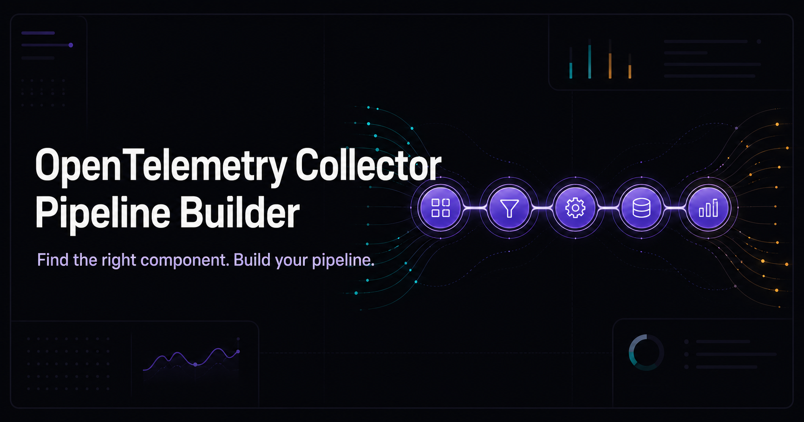

# OpenTelemetry Collector Pipeline Builder



A static React interface for browsing OpenTelemetry Collector Contrib receivers,
processors, exporters, extensions, and connectors, then assembling them into a
visual pipeline with a generated Collector YAML configuration.

## Local development

Requires Node.js 22 or later.

```bash
npm install
npm run dev
```

Create a production build with:

```bash
npm run build
```

The static output is written to `dist/`.

## Deploy to GitHub Pages

1. Push this project to a GitHub repository using the `main` branch.
2. In the repository, open **Settings → Pages**.
3. Under **Build and deployment**, select **GitHub Actions** as the source.
4. Push a commit to `main`, or run **Deploy to GitHub Pages** from the Actions tab.

The workflow in `.github/workflows/deploy-pages.yml` builds and deploys the site.
The Vite configuration uses relative asset paths, so it works for both user sites
and repository sites without changing the repository name.

## Automatic component updates

The `.github/workflows/sync-components.yml` workflow runs every day at 03:17 UTC
and can also be started manually from the Actions tab. It discovers the current
receiver, processor, exporter, extension, and connector directories on the
OpenTelemetry Collector Contrib `main` branch, refreshes their README-derived
documentation, verifies a production build, and commits changed generated data.
A successful sync explicitly triggers the existing GitHub Pages deployment
workflow so automated commits are published even when they use GitHub's built-in
workflow token.

Run the same refresh locally with:

```bash
npm run sync:components
```

## Project structure

- `app/page.tsx` — component data and interface
- `app/globals.css` — responsive visual design
- `src/main.tsx` — browser entry point
- `scripts/sync-component-catalog.mjs` — upstream component discovery
- `public/` — static assets
- `.github/workflows/deploy-pages.yml` — GitHub Pages deployment
- `.github/workflows/sync-components.yml` — daily component refresh

## Brand icons

Recognized technologies use locally bundled SVG marks from [Simple Icons](https://simpleicons.org/),
whose entries link to official brand sources and guidelines. Generic Collector components retain
their category symbol so the interface does not imply a false brand association. The Simple Icons
CC0 license and trademark disclaimer are included under `public/logos/`.
AWS, Azure, and Oracle marks are bundled from the Devicon project because those
marks are not present in the current Simple Icons release. Cloud-provider marks
are used only for component names beginning with the corresponding provider name.
